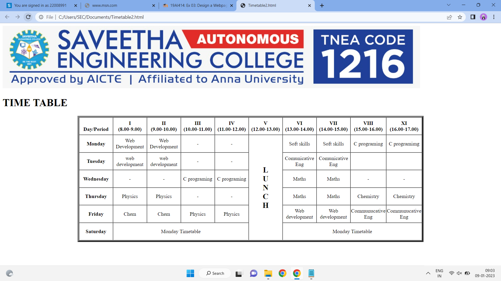

# Experiment_Time_Table

## AIM
To Write a html webpage page to display your timetable.

# ALGORITHM
### STEP 1
create a simple table using table tag
### STEP 2
Add header row using th tag
### STEP 3
Add your timetable
### STEP 4
Execute the program

# CODE
```
<!DOCTYPE html>
<html>

<body>
     
	<h1>TIME TABLE</h1>
	<table border="5" cellspacing="0" align="center">
		<!--<caption>Timetable</caption>-->
		<tr>
			<td align="center" height="50"
				width="100"><br>
				<b>Day/Period</b></br>
			</td>
			<td align="center" height="50"
				width="100">
				<b>I<br>(8.00-9.00)</b>
			</td>
			<td align="center" height="50"
				width="100">
				<b>II<br>(9.00-10.00)</b>
			</td>
			<td align="center" height="50"
				width="100">
				<b>III<br>(10.00-11.00)</b>
			</td>
			<td align="center" height="50"
				width="100">
				<b>IV<br>(11.00-12.00)</b>
			</td>
			<td align="center" height="50"
				width="100">
				<b>V<br>(12.00-13.00)</b>
			</td>
			<td align="center" height="50"
				width="100">
				<b>VI<br>(13.00-14.00)</b>
			</td>
			<td align="center" height="50"
				width="100">
				<b>VII<br>(14.00-15.00)</b>
			</td>
			<td align="center" height="50"
				width="100">
				<b>VIII<br>(15.00-16.00)</b>
			</td>
            <td align="center" height="50"
				width="100">
				<b>XI<br>(16.00-17.00)</b>
			</td>
		</tr>
		<tr>
			<td align="center" height="50">
				<b>Monday</b></td>
			<td align="center" height="50">Web Development</td>
			<td align="center" height="50">Web Development</td>
			<td align="center" height="50">-</td>
            <td align="center" height="50">-</td>
			<td rowspan="6" align="center" height="50">
				<h2>L<br>U<br>N<br>C<br>H</h2>
			</td>
			<td align="center" height="50">Soft skills</td>
			<td align="center" height="50">Soft skills</td>
            <td align="center" height="50">C programing</td>
            <td align="center" height="50">C programimg</td>
		</tr>
		<tr>
			<td align="center" height="50">
				<b>Tuesday</b>
			</td>
			</td>
			<td align="center" height="50">web development</td>
			<td align="center" height="50">web development</td>
			<td align="center" height="50">-</td>
			<td align="center" height="50">-</td>
            <td align="center" height="50">Comunicative Eng</td>
            <td align="center" height="50">Comunicative Eng</td>
            <td align="center" height="50"></td>
            <td align="center" height="50"></td>

		</tr>
		<tr>
			<td align="center" height="50">
				<b>Wednesday</b>
			</td>
			<td align="center" height="50">-</td>
			<td align="center" height="50">-</td>
			<td align="center" height="50">C programing</td>
			<td align="center" height="50">C programing</td>
			<td align="center" height="50">Maths</td>
			<td align="center" height="50">Maths</td>
            <td align="center" height="50">-</td>
            <td align="center" height="50">-</td>


			</td>
		</tr>
		<tr>
			<td align="center" height="50">
				<b>Thursday</b>
			</td>
			<td align="center" height="50">Physics</td>
			<td align="center" height="50">Physics</td>
			<td align="center" height="50">-</td>
            <td align="center" height="50">-</td>
			<td align="center" height="50">Maths</td>
			<td align="center" height="50">Maths</td>
			<td align="center" height="50">Chemistry</td>
			<td align="center" height="50">Chemistry</td>
		</tr>
		<tr>
			<td align="center" height="50">
				<b>Friday</b>
			</td>
			
			<td align="center" height="50">Chem</td>
			<td align="center" height="50">Chem</td>
			<td align="center" height="50">Physics</td>
			<td align="center" height="50">Physics</td>
			<td align="center" height="50">Web development</td>
			<td align="center" height="50">Web development</td>
			<td align="center" height="50">Communucative Eng</td>
			<td align="center" height="50">Communucative Eng</td>
		</tr>
		<tr>
			<td align="center" height="50">
				<b>Saturday</b>
			</td>
			<td colspan="4" align="center"
				height="50">Monday Timetable
			</td>
			<td colspan="4" align="center"
				height="50">Monday Timetable
			</td>

			
		</tr>
	</table>
            <ol>
              <center>
               <LI>19AI414-Web development  - Karthik Govidharaju</LI>
               <LI>19EY701-Soft skills  - Ayisha</LI>
               <LI>19CS302P1-C programing  - Sujitha</LI>
               <LI>19EN101-Comunicative English  - Parivanthan</LI>
               <LI>19MA201-Maths  -Suresh.R</LI>
               <LI>19PH206-Physics  -Ganapathi Raman</LI>
               <LI>19CY205-Chemistry  -Yamini</LI>
              
              <Center>
           </ol>

</u1>
</body>

</html>


```

# OUPUT
